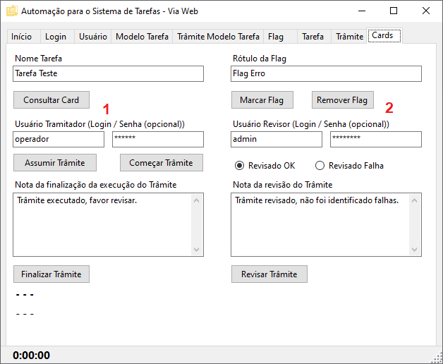

# SistemaTarefas Robô de Automação Web

**Desenvolvido em Selenium com .NET C#, esta ferramenta serve para testar e demonstrar conceitos de automatização dos processos.**

É um programa em Windows Forms, que utiliza o frontend web, que acessa uma API RESTful.

## Projetos relacionados.

Este Robô faz parte do **Ecossistema SistemaTarefas**. Seu objetivo é fornecer uma base de testes automatizados, posibilitando automação de processos e também apresentar o ecossistema.
Consome o frontend web desenvolvido em React.js.**

| 🧩 Projetos | 💬 Descrição | 📁 Repositório|
|----------|------------|-------------|
| **API** | API RESTful desenvolvida em **C# (.NET)**, responsável por fornecer os dados e a lógica de negócio. | [SistemaTarefas API](https://github.com/anderson-asouza/sistema-tarefas-api) |
| **Frontend** | Aplicação em **React.js** que consome a API e fornece a interface web para o usuário. | [SistemaTarefas Frontend](https://github.com/anderson-asouza/sistema-tarefas-react) |
| **Robot** | Automação em **Selenium** que interage com o frontend web para automatização de testes e processos. | **(Este projeto)* |

> 💡 Observação:
>
> O Robot depende do frontend web estar acessível para realizar as automações.
> O frontend depende da API estar acessível para funcionar.

---

## Instruções

A seguir, algumas telas com explicações dos detalhes de uso da ferramenta:

---

**1.** Abas para seleção das automações.

**2.** **"URL do Web Site"** — É o endereço onde o frontend web está sendo executado. Por padrão, já vem configurado com a URL do React.js apontando para `localhost:3000`.

**3.** **"Iniciar Web Robot"** — Antes de processar qualquer automação, é necessário iniciar o Robot. Ao lado, selecione o navegador desejado.

**4.** **"Automações em Sequência"** — A ferramenta irá alternar automaticamente entre as abas superiores e executar as automações.
Algumas automações não serão executadas nesse modo, como a maioria dos processos de **Excluir**, pois um registro criado pode ser necessário nas etapas seguintes. Se for excluído durante a sequência, ele deixaria de existir para o próximo passo. Porém, a exclusão pode ser executada individualmente clicando diretamente no botão Excluir da automação correspondente.

**1.** **"Nome do Usuário (para CONSULTA)"** — Campos marcados como CONSULTA são usados para localizar registros durante automações de consulta, exclusão e atualização. Aceitam nome aproximado. Caso mais de um registro seja encontrado, o Robot informará.

**2.** **"Nome do Usuário (para CADASTRO)"** — Campos marcados como CADASTRO são utilizados durante o cadastro e também durante atualizações.

**3.** Botões de automação — Cada botão executa o processo correspondente à sua função.

**4.** No caso do módulo de Usuários, a Automação em Sequência inclui a etapa de *Excluir*, pois o usuário criado nessa automação não é utilizado nas etapas seguintes (que utilizam outro usuário já existente no sistema).

**1.** **"Nome do Modelo de Tarefa (para VÍNCULO)"** — Campos marcados como VÍNCULO são utilizados para associar o registro à entidade Pai.
Não há dropdown ou combobox para escolher o vínculo, pois a ferramenta acessa a página web diretamente e não possui os dados das tabelas do banco localmente.
É necessário digitar o nome do vínculo pai (aceita nome aproximado). Caso mais de um registro seja encontrado, o Robot informará.

**1 e 2.** Nos itens destacados (1 e 2), os campos **"Login / Senha (opcional)"** definem, respectivamente, o usuário **Tramitador** e o usuário **Revisor**.

- Se **não** informar a senha, o Robot utilizará o usuário atualmente logado.

- Se informar a senha, o Robot fará login com o usuário especificado.

- Para **Automações em Sequência**, é **obrigatório** informar as senhas, pois há troca dinâmica de usuário entre Tramitador e Revisor.

- Para executar processos individualmente (clicando diretamente nos botões), informar a senha é opcional caso você queira usar o usuário já logado.